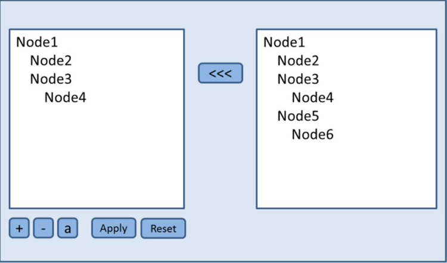

# 🔗 Тестовое задание Cash tree

[Демо](https://cash-tree.onrender.com/)

### Условия:

Существует некоторая база данных, представляющая собой агрегатную иерархию однородных элементов (дерево). В этой БД каждый элемент, кроме корня, имеет родительский элемент. Каждый элемент имеет строковое поле Value. Существует необходимость добавлять/удалять/изменять элементы в этой базе.
Внимание: существующие связи изменять НЕЛЬЗЯ.
При удалении дочерние элементы удаляются тоже. Предполагается, что база достаточна большая, чтобы нельзя было ее полностью загрузить для редактирования.

### Требования:

Поскольку база слишком велика, чтобы загрузить полностью за один раз, предполагается использовать некоторый локальный КЭШ. Пользователь имеет возможность доставать из БД элементы произвольно в некоторый локальный кэш, по одному элементу. В случае если два (или более) элемента в КЭШе связаны между собой непосредственной связью, они должны автоматически образовывать иерархию, чтобы пользователь видел их отношение между собой. Пользователь имеет возможность редактировать/удалять/добавлять элементы, работая в КЭШе. (Под редактированием подразумевается изменение поля Value) Пользователь имеет возможность произвести сохранение изменений в исходную БД (нажатием кнопки «Применить»), одномоментно все сделанные изменения.
Внимание: Кэш может обращаться к базе и элементам базы только в двух случаях: а) когда пользователь забирает элемент из базы и б) когда пользователь применяет все изменения. В остальных случаях Кэш не имеет доступа к базе и к элементам базы.
Внимание: удаленные элементы не удаляются, а помечаются как удаленные и не доступны для редактирования (и в базе и в кэше).
Внимание: Кэш должен пытаться не вводить пользователя в заблуждение, в условиях ограниченного доступа к базе данных.

### Требования к реализации:

Форма или web-страничка с двумя TreeView компонентами. Один будет отображать/эмулировать БД, другой будет отображать/эмулировать КЭШ. Соответственно DBTreeView и CachedTreeView. Оба компонента имеют контекстное меню или панель кнопок (что удобнее в зависимости от опыта), далее просто панель инструментов. DBTreeView в своей панели инструментов имеет единственную команду – загрузить выбранные элемент в КЭШ. В этом случае элемент появляется в CachedTreeView . CachedTreeView имеет следующие команды в своей панели инструментов: Удалить выбранный элемент, задать значение выбранного элемента, добавить новый дочерний элемент, произвести сохранение изменений в БД. По умолчанию на старте должна быть дефолтная база данных с уровнем вложенности не менее 4. Кнопка резет приводит приложение в начальное состояние.

